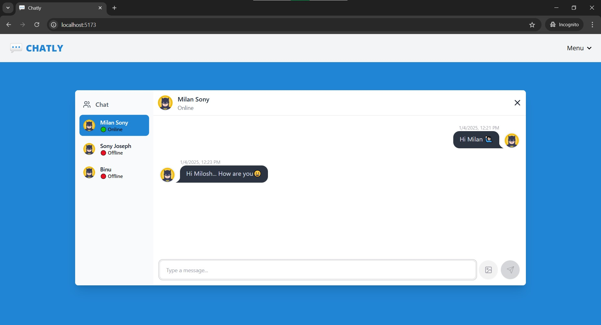

# ChatApp

A simple chat app build on **MERN stack**

[Backend API URL](https://github.com/milan-sony/api_chatapp)

## 🗝 Key features of ChatApp

✨ TailwindCSS + Daisy UI

🔐 Authentication & Authorization with JWT

💬 Real-time messaging with Socket.io

🚀 Online user status

🔗 Global state management with Zustand

🐞 Error handling both on server and client side

## Run locally

### Clone this project

```
git clone https://github.com/milan-sony/ChatApp.git
```

### Prerequisite

`node version: >=18.0.0 <22.11.0`

`npm version: >=8.0.0 <10.9.0`

### Install the packages/dependencies needed for this project

```
npm install
```

### Setup .env file

Under the root directory make a file named `.env`

```
VITE_APP_API_URL = http://localhost:3000/api/v1
```

### Run the project

```
npm run dev
```

### Screenshot


